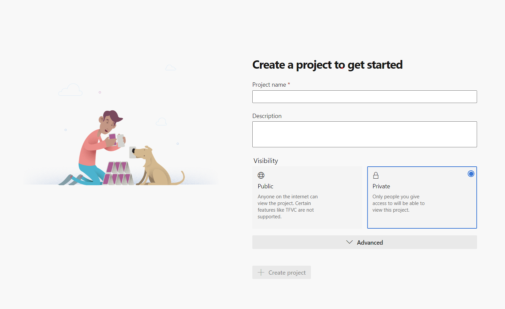
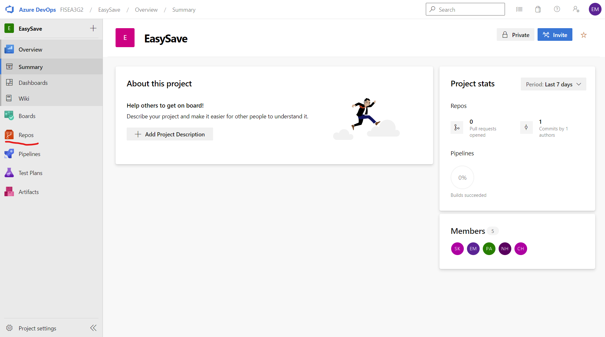
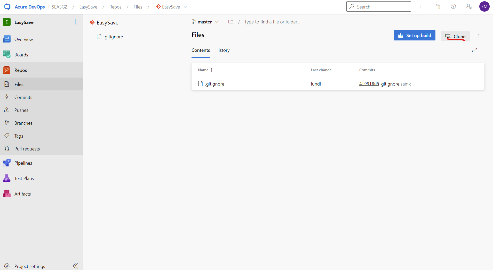
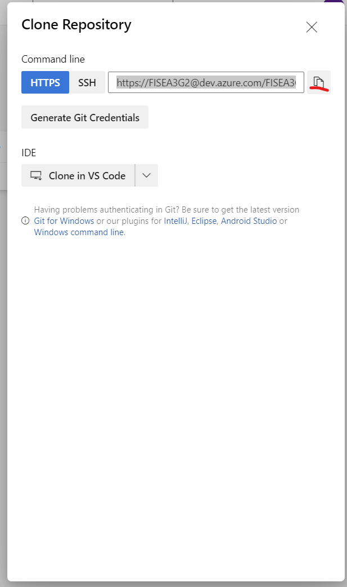
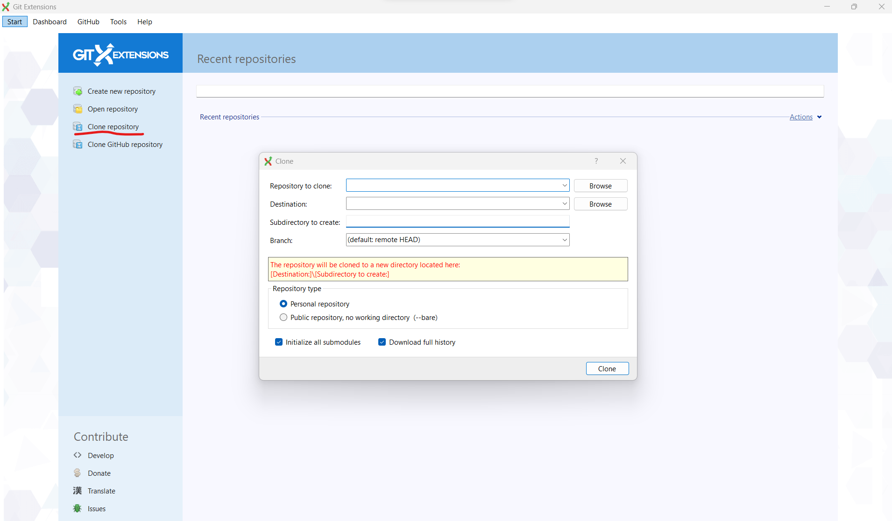

## Débuter avec Azure Devops

- Connectez vous sur [https://dev.azure.com](https://dev.azure.com)

#### Création du premier projet

#### Parcourir le projet Azure Devops

Lorsque cous créez un projet, Azure Devops vous bascule automatiquement sur la vue projet

Vous pouvez accèder au repository git créer par défaut en cliquant sur l'icone orange à gauche de l'écran

#### Cloner le repository Git

Dans la vue repository, vous pouvez récupérer le lien du git en cliquant sur le bouton clone en haut à droite de l'écran

Copier le lien donner par Azure Devops

##### Cloner avec la ligne de commande Git

- Ouvrez un terminal dans le dossier où vous souhaitez conserver les fichiers du repository
- Exécuter la commande suivante :
- > git clone LIEN_DU_REPOSITORY_AZURE_DEVOPS

##### Cloner avec GitExtensions

Utiliser la fonction "Clone repository" dans GitExtensions (égament disponible dans le menu "Start").

Renseigner le lien du repository Azure devops et le chemin vers le dossier cible sur votre ordinateur.

